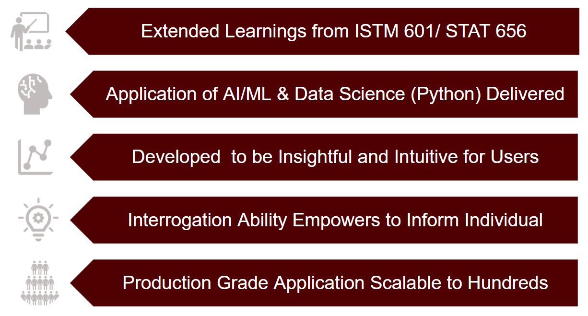

# Stocks

## Executive Summary

## Goals
Extend stocks homework assignment in week 6 (Stocks GUI) This project will use a python 
framework to take advantage of web based graphical user interface, able to run in browser 
on any device. This new GUI will transform all modules from tkinter to a HTML, using Plotly and Dash.

## Features
* Favorite list of 20 Stocks 
* Type and search for a new stock by symbol 
* Stock Price
* Previous Close 
* Volume
* Plots of Closing Price and Volume
* Company Description
* Company Sector
* Sentiment Analysis of articles

## Required Packages
* [dash](https://plotly.com/dash/)
* [dash-bootstrap-components](https://dash-bootstrap-components.opensource.faculty.ai/)
* [google-auth](https://console.cloud.google.com/)
* [google-cloud-language](https://console.cloud.google.com/)
* [newsapi-python](https://newsapi.org/)
* [pandas](https://pandas.pydata.org/)
* [pandas-datareader](https://pandas-datareader.readthedocs.io/en/latest/)
* [plotly](https://plotly.com/)
* [requests](https://docs.python-requests.org/en/master/)
* [yfinance](https://pypi.org/project/yfinance/) 
